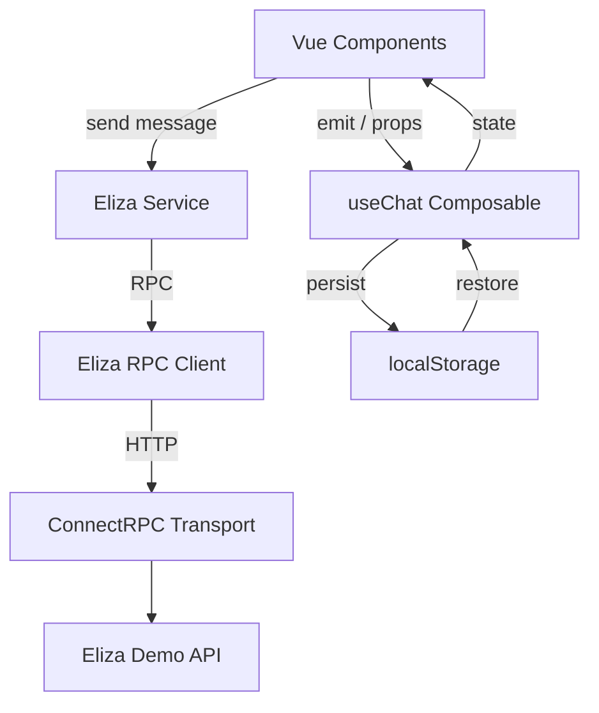

# Eliza Chat

Simple chat application built with **Vue 3** and **TypeScript**, communicating with the Eliza demo backend via **ConnectRPC**.

---

## Technologies

- **Vue 3** (Composition API)
- **TypeScript**
- **Vite**
- **ConnectRPC**
- **Vitest**
- **@vue/test-utils**
- **ESLint v9**

---

## Installation

1. Clone the repository:

```bash
git clone https://github.com/<your-username>/eliza-chat.git
```

2. Install dependencies:

```bash
npm install
```

## Running the project in development

```bash
npm run dev
```

## Production build

```bash
npm run build
```

## Running production build

```bash
npm run start
```

## Testing

```bash
npm run test
```

## What is covered by tests

- Composable (useChat)
  - adding messages
  - validation
  - persistence to localStorage
  - restoring state

- Components
  - Chat.vue — async flow, loading state, error handling
  - Input.vue — validation, emits, disabled state
  - Message.vue — rendering based on message author

All external dependencies (RPC service, composables) are mocked to keep tests fast and deterministic.

## Linting

```bash
npm run lint
```

If there are no issues, the following message will be displayed:

```bash
ESLint: no errors found
```

## Project Structure

```bash
src/
├─ assets/              # Static assets
├─ components/          # Vue components (Chat, Input, Message)
├─ composables/         # Reusable logic (useChat)
├─ constants/           # Shared constants
├─ helpers/             # Validation, time helpers
├─ rpc/                 # ConnectRPC transport & client
├─ services/            # API services
├─ types/               # TypeScript types
├─ App.vue
├─ main.ts
└─ style.css
```

## Architecture Diagram


